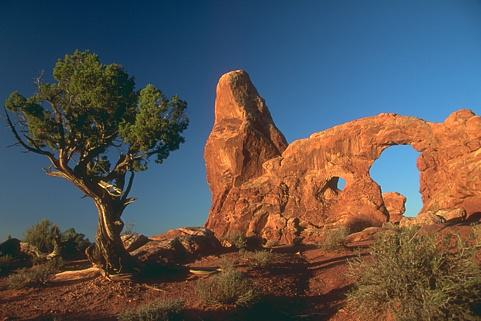
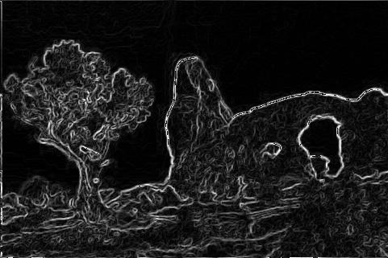
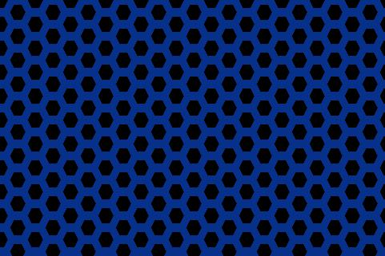
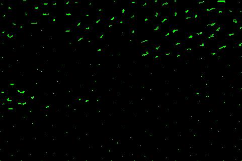
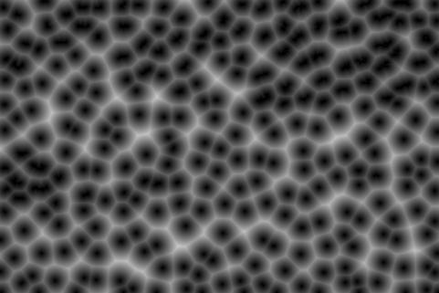
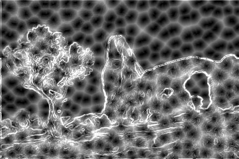
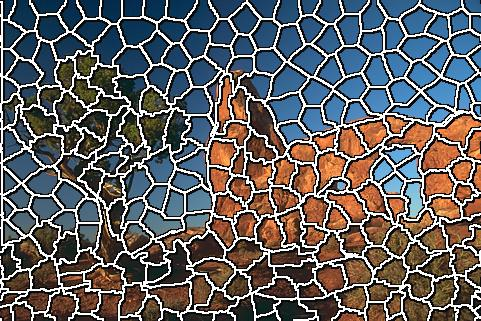

# Waterpixels

<p>
An image segmentation software aiming at producing superpixels called waterpixels due to the use of the watershed algorithm.
<p/>

<p>
Those waterpixels allow to regularly split an image into subregions, with the constraint that each subregion follows the contours of the elements in the image.
<p/>

<p>
Contour detection is a first step in an image processing pipeline, which can be used for computer vision, facial recognition or robotics.
<br/>

<p>
That is a C++ implementation using Qt5 for the GUI system and OpenCL for some GPU calculations.<br/>
The waterpixels generation method is based on the following research paper :
<p/>

[https://hal.archives-ouvertes.fr/hal-01212760/document](https://hal.archives-ouvertes.fr/hal-01212760/document)

## Dependencies

- [Conan](https://conan.io/)
- [VCPKG](https://vcpkg.io/)
- [CMake](https://cmake.org/)

## Build

```
conan install . -s build_type=Release --build missing --install-folder=build
cmake -DCMAKE_TOOLCHAIN_FILE=${PATH_TO_VCPKG}/scripts/buildsystems/vcpkg.cmake -B build -S .
```

## Waterpixels generation method

There are six steps to generate the waterpixels :

### Step 1 : Load an image

<p align=center>
<b>Original image</b><br/>

</p>

### Step 2 : Compute the image gradient

<p>
The gradient computation is done in the CIELAB color space, which better matches our human color differences perception, which is not the case in the RGB color space.
<p/>
<p>
First thing is to go from RGB color space to XYZ color space :
<p/>

$$
\begin{bmatrix}
X\\
Y\\
Z\\
\end{bmatrix}
\equal
\begin{bmatrix}
0.618 & 0.177 & 0.205 \\ 
0.299 & 0.587 & 0.114 \\ 
0.0 & 0.056 & 0.944 \\
\end{bmatrix}
\times
\begin{bmatrix}
R\\
G\\
B\\
\end{bmatrix}
$$

<p>
Then we compute the X, Yn and Zn terms :
<p/>

$$
\begin{bmatrix}
Xn\\
Yn\\
Zn\\
\end{bmatrix}
\equal
\begin{bmatrix}
0.618 & 0.177 & 0.205 \\ 
0.299 & 0.587 & 0.114 \\ 
0.0 & 0.056 & 0.944 \\
\end{bmatrix}
\times
\begin{bmatrix}
255\\
255\\
255\\
\end{bmatrix}
$$

<p>
And at last, we go from the XYZ color space to the CIELAB color space by using the<br/>
following formulas :
<p/>

$L = 116 \times (\frac{Y}{Yn})^\frac{1}{3} - 16$ pour $\frac{Y}{Yn} > 0.008856$ <br/><br/>
$L = 903.3 \times \frac{Y}{Yn}$ pour $\frac{Y}{Yn} \leq 0.008856$ <br/><br/>
$a = 500 \times(f(\frac{X}{Xn}) - f(\frac{Y}{Yn}))$ <br/><br/>
$b = 200 \times(f(\frac{Y}{Yn}) - f(\frac{Z}{Zn}))$ <br/><br/>
Avec :<br/>
pour $t > 0.008856$, $f(t) = \sqrt[3]{t}$ <br/>
pour $t \leq 0.008856$, $f(t) = 7.7787 \times t + \frac{16}{116}$ <br/>

<p>
Once in the CIELAB color space, we can compute the gradient using a Sobel filter.
<p/>
Sobel for gradient along X axis $Gx$ :

|-1|0|+1|
|:-:|:-:|:-:|
|-2|0|+2|
|-1|0|+1|

Sobel for gradient along Y axis $Gy$ :

|+1|+2|+1|
|:-:|:-:|:-:|
|0|0|0|
|-1|-2|-1|

Finally, the gradient value for each pixel is $G = sqrt(Gx^2 + Gy^2)$

<p align=center>
<b>Gradient</b><br/>

</p>

### Step 3 : Compute a grid and cell markers

An hexagonal grid with a user defined size is layed upon the image.

<p align=center>
<b>Grid</b><br/>

</p>

Then comes the markers selection step.<br/>
For each cell, the greater set of connected pixels for which the gradient value is the lowest is selected and colored in green.<br/>
Those markers will serve as our seeds for the watershed algorithm done at step 5.

<p align=center>
<b>Markers in each grid cell</b><br/>

</p>

### Step 4 : Voronoï tesselation

The Voronoï tesselation is done with the markers computed at the previous step.

<p align=center>
<b>Voronoï tesselation from the markers</b><br/>

</p>

### Step 5 : Gradient regularization

One criteria must be satisfied by our waterpixels : they must be roughly equivalent in size and shape.<br/>
The regularization step is about merging the images obtained at steps 2 and 4.

<p align=center>
<b>Voronoï tesselation from the markers</b><br/>

</p>

### Step 6 : Image segmentation with the watershed algorithm

Watershed : flood the image obtained at step 5 (our relief) with the markers computed at step 3 (our water sources).

<p align=center>
<b>Waterpixels</b><br/>

</p>
